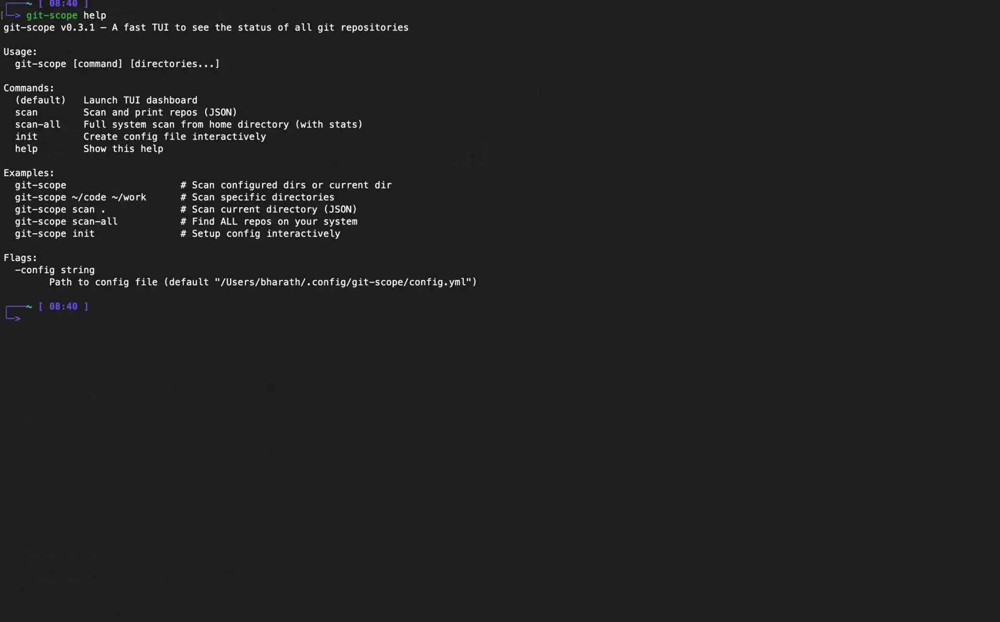

# git-summary

> **A fast TUI dashboard to view the git status of *all your repositories* in one place.** > Stop the `cd` → `git status` loop.

[](https://goreportcard.com/report/github.com/curtis2point1/git-summary)
[](https://github.com/curtis2point1/git-summary/releases)
[](https://opensource.org/licenses/MIT)
[](https://github.com/curtis2point1/git-summary/stargazers)



---

## ⚡ Installation

Get started in seconds.

### From Local Source (macOS/Linux)

Use this when working from a local checkout and Go is installed:

```bash
cd ~/dev/personal/git-summary
git pull --ff-only
mkdir -p "$HOME/.local/bin"
go build -o "$HOME/.local/bin/git-summary" ./cmd/git-summary
git-summary --version
```

Make sure `~/.local/bin` is on your `PATH`. For zsh:

```bash
export PATH="$HOME/.local/bin:$PATH"
```

If `GOBIN` is set to `~/.local/bin`, this shorter command is equivalent:

```bash
go install ./cmd/git-summary
```

### Universal Installer (macOS/Linux)

This downloads the latest GitHub release binary and requires a published release.

```bash
curl -sSL https://raw.githubusercontent.com/curtis2point1/git-summary/main/scripts/install.sh | sh
```

### From Source (Windows)

```bash
go install github.com/curtis2point1/git-summary/cmd/git-summary@latest
```

*If you find this useful, please consider giving it a ⭐ star to help others find it\!*

-----

## 🚀 Usage

Simply run it in any directory containing your projects:

```bash
git-summary
```

#### Commands
```bash
git-summary              # Launch TUI dashboard
git-summary init         # Create config file interactively
git-summary scan         # Scan and print repos (JSON)
git-summary scan-all     # Full system scan from home directory
git-summary issue        # Open GitHub issues page in browser
git-summary -h           # Show help
```

*By default, it recursively scans the current directory. You can configure permanent root paths later.*

-----

## 🆚 git-summary vs. lazygit


  * **git-summary** is for your **workspace** (bird's-eye view).
  * **lazygit** is for a specific **repository** (deep dive).

| Feature | **git-summary** | **lazygit** |
| :--- | :--- | :--- |
| **Scope** | **All repos at once** | One repo at a time |
| **Primary Goal** | Find what needs attention | Stage/Commit/Diff |
| **Fuzzy Search** | Find repo by name/path | ❌ |
| **Integration** | Press `Enter` to open editor | Press `Enter` to stage files |
| **Performance** | \~10ms startup (cached) | Slower on large monorepos |

-----

## ✨ Features

  * **📁 Workspace Switch** — Switch root directories without quitting (`w`). Supports `~`, relative paths, and **symlinks**.
  * **🔍 Fuzzy Search** — Find any repo by name, path, or branch (`/`).
  * **🛡️ Dirty Filter** — Instantly show only repos with uncommitted changes (`f`).
  * **📄 Pagination** — Navigate large repo lists with page-by-page browsing (`[` / `]`). Shows 15 repos per page with a dynamic page indicator.
  * **🚀 Editor Jump** — Open the selected repo in VSCode, Neovim, Vim, or Helix (`Enter`).
  * **⚡ Blazing Fast** — JSON caching ensures \~10ms launch time even with 50+ repos.
  * **📊 Dashboard Stats** — See branch name, staged/unstaged counts, and last commit time.
  * **🌿 Contribution Graph** — GitHub-style local heatmap for your activity (`g`).
  * **💾 Disk Usage** — Visualize `.git` vs `node_modules` size (`d`).
  * **⏰ Timeline** — View recent activity across all projects (`t`).
  * **🔗 Symlink Support** — Symlinked directories resolve transparently (great for Codespaces/devcontainers).

-----

## ⌨️ Keyboard Shortcuts

| Key | Action |
| :--- | :--- |
| `w` | **Switch Workspace** (with Tab completion) |
| `/` | **Search** repositories (Fuzzy) |
| `f` | **Filter** (Cycle: All / Dirty / Clean) |
| `s` | Cycle **Sort** Mode |
| `1`–`4` | Sort by: Dirty / Name / Branch / Recent |
| `[` / `]` | **Page Navigation** (Previous / Next) |
| `Enter` | **Open** repo in Editor |
| `c` | **Clear** search & filters |
| `r` | **Rescan** directories |
| `g` | Toggle **Contribution Graph** |
| `d` | Toggle **Disk Usage** view |
| `t` | Toggle **Timeline** view |
| `q` | Quit |

-----

## ⚙️ Configuration

Edit workspace location and code editor of your choice in `~/.config/git-summary/config.yml`:


```yaml
# ~/.config/git-summary/config.yml
roots:
  - ~/code
  - ~/work/microservices
  - ~/personal/experiments

ignore:
  - node_modules
  - .venv
  - dist

editor: code # options: code,nvim,lazygit,vim,cursor
```

-----

## 💡 Why I Built This

I work across dozens of small repositories—microservices, dotfiles, and side projects. I kept forgetting which repos had uncommitted changes or unpushed commits.

My mornings used to look like this:

```bash
cd repo-1 && git status
cd ../repo-2 && git status
# ... repeat for 20 repos
```

`git-summary` helps solve the **"Multi-Repo Blindness"** problem. It gives you a single screen to see what is dirty, what is ahead/behind, and where you left off yesterday.

-----

## 🗺️ Roadmap

  - [x] In-app workspace switching with Tab completion
  - [x] Symlink resolution for devcontainers/Codespaces
  - [ ] Background file watcher (real-time updates)
  - [ ] Quick actions (bulk pull/fetch)
  - [ ] Repo grouping (Service / Team / Stack)
  - [ ] Custom team dashboards

## 📄 License

MIT. This project is derived from [Bharath-code/git-scope](https://github.com/Bharath-code/git-scope), originally created by Bharath, and includes modifications by [curtis2point1](https://github.com/curtis2point1).

---

## 🙏 Acknowledgements

Built with these amazing open-source projects:

- [Bubble Tea](https://github.com/charmbracelet/bubbletea) — The TUI framework
- [Lip Gloss](https://github.com/charmbracelet/lipgloss) — Style definitions
- [Bubbles](https://github.com/charmbracelet/bubbles) — TUI components (table, spinner, text input)

---

## ⭐ Star History

<a href="https://star-history.com/#curtis2point1/git-summary&Date">
 <picture>
   <source media="(prefers-color-scheme: dark)" srcset="https://api.star-history.com/svg?repos=curtis2point1/git-summary&type=Date&theme=dark" />
   <source media="(prefers-color-scheme: light)" srcset="https://api.star-history.com/svg?repos=curtis2point1/git-summary&type=Date" />
   
 </picture>
</a>

---

## 👥 Contributors

<a href="https://github.com/curtis2point1/git-summary/graphs/contributors">
  
</a>

Made with [contrib.rocks](https://contrib.rocks).
